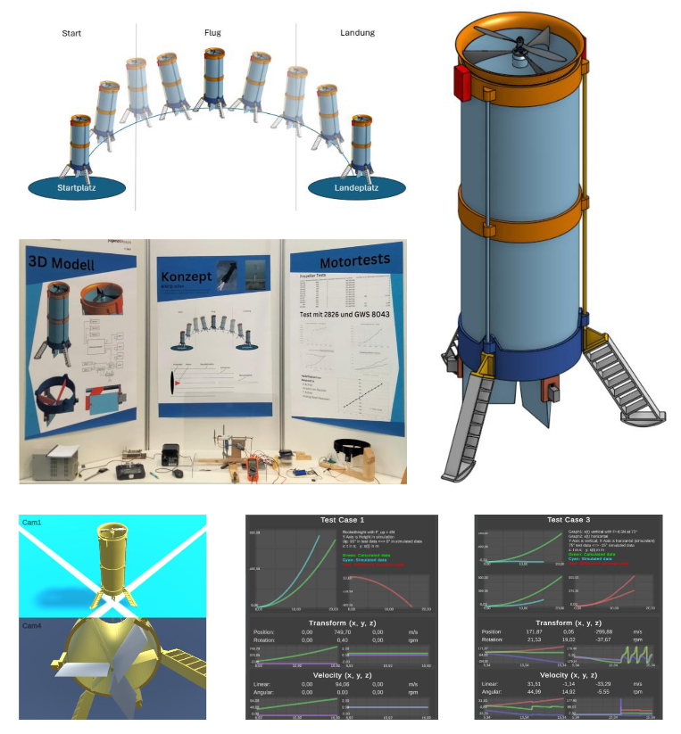

# Autonomes Luftfahrzeug (ALL) – Q1 Projektarbeit

Dieses Repository enthält die Projektarbeit der Q1 (2024/25), bei der wir ein Konzept für ein autonomes luftbetriebenes Luftfahrzeug (ALL) entwickelt haben. 
Das Projekt umfasste **3D-Modellierung, Hardwaretests, Simulation und Software.**

## Projektidee
Inspiriert durch die SpaceX Starship Tests (v.a. Landung SN10) wollten wir ein komplexes Projekt umsetzen, das uns an die Grenzen unseres Wissens bringt. Ziel war es, ein **autonomes Luftfahrzeug zu konzipieren**, das starten, stabil schweben und wieder selbstständig auf seiner Startplattform landen kann.

## Team und Organisation
**Mitglieder:**
- Jan Theiler
- Daniel Schmidt
- Max Mendgen
- Nelio Henning

**Aufteilung:**
- **Team I (Jan & Daniel)**: 3D-Modell, Hardware, Teilintegration
- **Team II (Max & Nelio)**: Simulation, Physik

Ursprünglich war geplant, beide Teile auch bei Jugend forscht einzureichen. 
Aufgrund des 3er-Teilnehmerlimits wurde das Projekt gesplittet.
Team I reichte seinen Teil ein, gewann den 1. Platz in der Regionalrunde und einen Sonderpreis von OHB.

Die Simulation (Team II) konnte wegen der hohen Komplexität nicht fertiggestellt werden. Dieser zweite Teil soll 2026 separat bei Jugend forscht eingereicht werden.

## Inhalte des Repositories
- **Unity-Simulation (aktueller Stand)**
- **PDF Projektarbeit (Schule)**:
[„Entwicklung eines autonomen luftbetriebenen Luftfahrzeugkonzeptes (ALL): 3D Modell, Simulation, Software & Teilintegrationstests“](External/PK_2INF2%20Projektarbeit%20Jan%20Theiler%2C%20Daniel%20Schmidt%2C%20Max%20Mendgen%2C%20Nelio%20Henning%20Abgabe.pdf)
- **PDF Jugend-forscht (Team I)**:
[„Motortests und Erstellung eines 3D Models für ein positionsstabilisierendes Luftobjekt“](External/JuFoArbeit24-25V7.pdf)

## Technische Schwerpunkte
- 3D-Modellierung mit CAD (OnShape)
- Hardwaretests (Motoren, Propeller, Sensoren)
- Entwicklung von Regelungskonzepten (PID)
- Implementierung einer Physik-Simulation in Unity (laufendes Projekt)
- Teilweise autonome Steuerung

## Erfahrungen
Für Max, Nelio und Daniel war dies die **erste (größere) Projektarbeit**.
Wir haben sehr viel gelernt über:
- Teamarbeit und Projektmanagement (Scrum)
- Physik (Aerodynamik, Regelungstechnik)
- CAD und 3D-Druck
- Unity und Simulationsentwicklung
- Hardwaretests

## Zukunft
- Fertigstellung und Abgabe der Simulation (Team II) bei Jugend forscht 2026
- Weiterentwicklung der Steuerungssoftware und vollständige Integration von Simulation und Hardware

## Autoren & Credits
- Jan Theiler
- Daniel Schmidt
- Max Mendgen
- Nelio Henning

Betreuung: Q1 Projektkurs Informatik 2024/25, Herrn Herrmann  (Schule: Gymnasiale Oberstufe Carl von Ossietzky Bremerhaven)

## Lizenz
Dieses Projekt ist zu Lern- und Demonstrationszwecken öffentlich.
